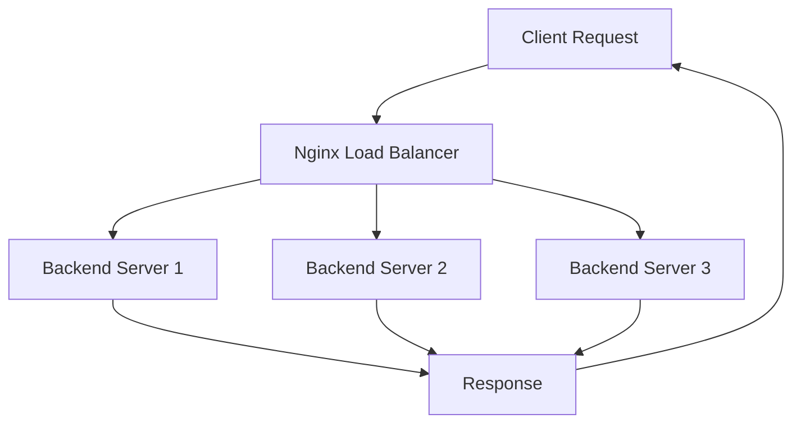

```markdown
## Advanced Nginx Patterns and Use Cases

Nginx is a powerful, high-performance web server and reverse proxy known for its versatility in handling modern web traffic. Beyond simple static hosting, **advanced Nginx configurations** enable complex use cases such as **load balancing**, **content caching**, **rate limiting**, and **complex URL rewrites**—all critical for building scalable, efficient, and secure web infrastructure.

---

### 1. Load Balancing Algorithms

**What is Load Balancing?**  
Load balancing distributes incoming network traffic across multiple backend servers to ensure no single server becomes overwhelmed. This improves reliability, responsiveness, and fault tolerance.

**Why Load Balancing?**  
Imagine a busy restaurant with multiple chefs (servers). Instead of all orders going to one chef, the host distributes orders evenly or based on specific rules to keep the kitchen running smoothly.

**Common Load Balancing Algorithms in Nginx:**

- **Round Robin (default):** Requests are distributed evenly, one after another.
- **Least Connections:** Sends requests to the server with the fewest active connections, ideal when servers have varying capacities.
- **IP Hash:** Routes requests based on client IP, ensuring session persistence.

**Nginx Configuration Example (Round Robin):**
```nginx
http {
    upstream backend {
        server backend1.example.com;
        server backend2.example.com;
        server backend3.example.com;
    }

    server {
        listen 80;

        location / {
            proxy_pass http://backend;
        }
    }
}
```

---

### 2. Content Caching Policies

**What is Content Caching?**  
Caching stores copies of frequently accessed content closer to users or at the edge to reduce backend load and improve load times.

**Why Cache?**  
Think of caching like a coffee shop keeping popular pastries ready on the counter. Customers get their favorites quickly without waiting for a fresh bake.

**Key Caching Concepts:**

- **Cache-Control Headers:** Dictate how and when to cache content.
- **Proxy Cache Zones:** Enable Nginx to cache responses from backend servers.
- **Cache Purging:** Removes outdated content from the cache.

**Nginx Cache Configuration Example:**
```nginx
http {
    proxy_cache_path /data/nginx/cache levels=1:2 keys_zone=my_cache:10m max_size=1g inactive=60m use_temp_path=off;

    server {
        listen 80;

        location / {
            proxy_cache my_cache;
            proxy_cache_valid 200 302 10m;
            proxy_cache_valid 404 1m;
            proxy_pass http://backend;
        }
    }
}
```

---

### 3. Rate Limiting

**What is Rate Limiting?**  
Rate limiting restricts the number of requests a client can make within a given time frame to protect your server from overload or abuse.

**Why Rate Limit?**  
Imagine a toll booth that only allows a few cars through every minute to prevent traffic jams. Similarly, rate limiting prevents server overload and malicious attacks like DDoS.

**Nginx Rate Limiting Example:**
```nginx
http {
    limit_req_zone $binary_remote_addr zone=mylimit:10m rate=10r/s;

    server {
        listen 80;

        location /api/ {
            limit_req zone=mylimit burst=20 nodelay;
            proxy_pass http://backend;
        }
    }
}
```

- **`limit_req_zone`** defines a shared memory zone keyed by client IP.
- **`rate=10r/s`** allows 10 requests per second.
- **`burst=20`** permits temporary bursts of up to 20 requests.

---

### 4. Complex URL Rewrites

**What are URL Rewrites?**  
URL rewriting modifies request URLs dynamically, often to implement clean URLs, redirect traffic, or route requests internally.

**Why Use Rewrites?**  
It's like a receptionist redirecting visitors to the right office based on their request, even if the visitor doesn’t know the actual room number.

**Use Case: Redirect all `/old-path/*` requests to `/new-path/*`**

```nginx
server {
    listen 80;

    location /old-path/ {
        rewrite ^/old-path/(.*)$ /new-path/$1 permanent;
    }
}
```

In this example, a request to `/old-path/page1` will be redirected to `/new-path/page1`.

---

### Mermaid Diagram: Load Balancing Workflow



This diagram illustrates how Nginx receives client requests and forwards them to one of many backend servers based on the load balancing algorithm.

---

### Python Example: Simulating Load Balancer Decision

Here’s a simplified Python script to simulate **Round Robin** load balancing logic:

```python
class RoundRobinLoadBalancer:
    def __init__(self, servers):
        self.servers = servers
        self.index = 0

    def get_next_server(self):
        server = self.servers[self.index]
        self.index = (self.index + 1) % len(self.servers)
        return server

# List of backend servers
servers = ["backend1.example.com", "backend2.example.com", "backend3.example.com"]

lb = RoundRobinLoadBalancer(servers)

# Simulate incoming requests
for i in range(10):
    selected_server = lb.get_next_server()
    print(f"Request {i+1} routed to {selected_server}")
```

**Output:**
```
Request 1 routed to backend1.example.com
Request 2 routed to backend2.example.com
Request 3 routed to backend3.example.com
Request 4 routed to backend1.example.com
...
```

This example demonstrates how requests are evenly distributed using round-robin logic.

---

## Summary

Advanced Nginx configurations empower you to:

- Distribute traffic intelligently with **load balancing**,
- Speed up response times via **content caching**,
- Protect your services using **rate limiting**,
- Manage complex URL structures through **rewrites**.

Mastering these patterns will help you build scalable, efficient, and resilient web infrastructure fit for modern applications.
```