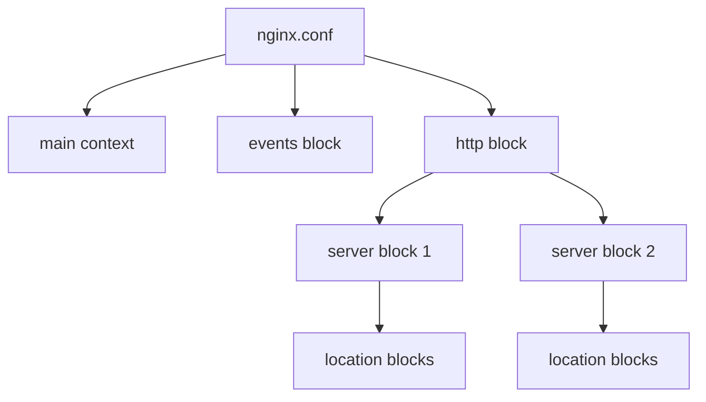

## Basic Nginx Configuration Syntax

Nginx is a powerful and efficient web server and reverse proxy server widely used to handle web traffic. Understanding its **configuration syntax** is essential for setting up and managing Nginx effectively.

---

### What is Nginx Configuration?

Nginx configuration files tell the server **how to behave**, what resources to serve, and how to process requests. Think of it as the **instruction manual** for Nginx.

- **Why is it important?**  
  Proper configuration ensures your web server runs smoothly, securely, and efficiently.

---

### Structure of the Nginx Configuration File

The main configuration file is usually located at `/etc/nginx/nginx.conf` or `/usr/local/nginx/conf/nginx.conf`.

The Nginx config file uses a **hierarchical structure** made up of:

- **Directives**  
- **Blocks (or contexts)**

---

### Key Concepts

#### 1. Directives

A **directive** is a single configuration statement that tells Nginx what to do.  
It consists of a **name** and **parameters**, and always ends with a semicolon (`;`).

Example:  
```nginx
worker_processes  1;
```

Here, `worker_processes` is the directive, and `1` is its parameter.

---

#### 2. Blocks (Contexts)

A **block** groups multiple directives together, enclosed by curly braces `{}`. Blocks can contain other blocks inside them, establishing a hierarchy.

Example:
```nginx
http {
    server {
        listen 80;
        server_name example.com;
    }
}
```

- `http` is a block containing one or more `server` blocks.  
- Each `server` block represents a virtual server configuration.

#### Real-world analogy:

> Imagine the Nginx config as a **company hierarchy**.  
> - The **http block** is like a department.  
> - Inside it, the **server blocks** are teams.  
> - The directives inside them are the **team rules or instructions**.

---

### Common Nginx Configuration Contexts

| Context    | Description                                      |
|------------|------------------------------------------------|
| `main`     | Global settings (outside any block).            |
| `events`   | Settings related to network connections.        |
| `http`     | HTTP server configuration (virtual hosts, etc.)|
| `server`   | Virtual server configuration inside `http`.    |
| `location` | Defines how to process specific request URIs inside `server`. |

---

### Basic Syntax Rules

- **Directives end with a semicolon** (`;`)  
- **Blocks use curly braces** `{}` to group directives  
- Comments start with `#` and continue to the end of the line  
- Whitespace (spaces, tabs, line breaks) is mostly ignored for readability  

Example with comments:  
```nginx
# Define number of worker processes
worker_processes  1;

events {
    # Maximum number of simultaneous connections
    worker_connections  1024;
}

http {
    server {
        listen 80;  # Listen on port 80 (HTTP)
        server_name example.com;  # Domain name

        location / {
            root /var/www/html;  # Document root
            index index.html index.htm;
        }
    }
}
```

---

### Visualizing Configuration Hierarchy (Mermaid Diagram)



---

### Python Example: Parsing a Simple Nginx Configuration Snippet

While Nginx config syntax is not JSON or YAML, you can write Python scripts to parse or generate simple configurations.

```python
# Simple Python script to generate a basic Nginx server block configuration

def generate_server_block(server_name, listen_port=80, root_path="/var/www/html"):
    config = f"""
server {{
    listen {listen_port};
    server_name {server_name};

    location / {{
        root {root_path};
        index index.html index.htm;
    }}
}}
"""
    return config.strip()

# Usage example
if __name__ == "__main__":
    server_config = generate_server_block("example.com")
    print(server_config)
```

**Output:**
```nginx
server {
    listen 80;
    server_name example.com;

    location / {
        root /var/www/html;
        index index.html index.htm;
    }
}
```

---

### Summary

| Concept      | Description                                            |
|--------------|--------------------------------------------------------|
| **Directive**| Single statement ending with `;`, e.g., `listen 80;`   |
| **Block**    | Group of directives enclosed in `{}`, e.g., `server { ... }` |
| **Contexts** | Specific blocks like `http`, `server`, `location`      |
| **Syntax**   | Use semicolons, braces, and comments with `#`         |

Understanding these basics will help you create robust and efficient Nginx configurations tailored to your needs.