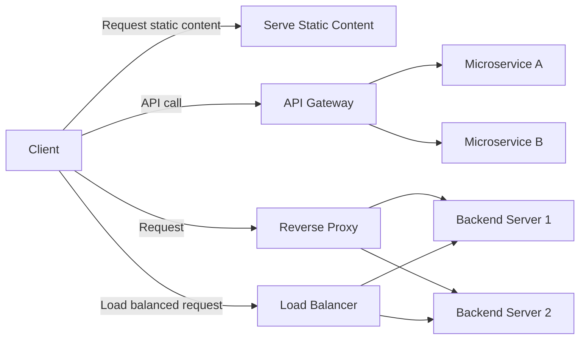

```markdown
## Common Use Cases of Nginx

**Nginx** (pronounced "engine-x") is a versatile and high-performance web server software widely adopted across the web ecosystem. Originally designed to efficiently serve websites, it has evolved into a multi-purpose tool used in various scenarios, including reverse proxying, load balancing, and acting as an API gateway.

This guide explores the most common use cases of Nginx, explaining what each use case entails, why it is important, and how Nginx fits into these roles.

---

### 1. Serving Static Content

#### What and Why?

**Static content** refers to files such as HTML, CSS, JavaScript, images, and videos that do not change dynamically and can be delivered directly to the client. Nginx is renowned for its ability to serve static files **extremely fast and efficiently**.

**Why use Nginx for static content?**  
- It uses an event-driven architecture that can handle thousands of concurrent connections with low memory usage.  
- It serves files directly from disk without unnecessary overhead.  
- It supports features like caching and compression to speed up delivery.

#### Real-world Analogy:  
Think of Nginx as a highly efficient librarian in a huge library. When you request a book (static file), Nginx quickly finds it and hands it over without delay, even if hundreds of other people are requesting books simultaneously.

---

### 2. Acting as a Reverse Proxy

#### What and Why?

A **reverse proxy** is a server that sits between client devices and backend servers, forwarding client requests to those servers and returning the responses. Nginx often acts as a reverse proxy to:  
- Protect backend servers by hiding their details from the public.  
- Handle SSL/TLS termination (decrypt HTTPS requests).  
- Cache responses to reduce backend load.  
- Perform request routing based on URL or headers.

#### Real-world Analogy:  
Imagine a receptionist (Nginx) at a busy office. All visitors (clients) first talk to the receptionist, who then directs them to the appropriate department (backend server) based on their needs, shielding the departments from direct contact.

---

### 3. Load Balancing

#### What and Why?

**Load balancing** distributes incoming network traffic across multiple servers to ensure no single server becomes overwhelmed. Nginx can act as a load balancer to:  
- Improve availability and reliability by distributing requests evenly.  
- Increase capacity by scaling horizontally.  
- Provide failover by redirecting traffic if a server goes down.

#### Real-world Analogy:  
Think of a busy restaurant with multiple waiters (servers). The host (Nginx) distributes incoming customers evenly among waiters so no one is overloaded and customers are served promptly.

---

### 4. API Gateway

#### What and Why?

An **API Gateway** is a server that acts as a single entry point for APIs, managing requests, authentication, rate limiting, and routing to various microservices. Nginx is often used as an API gateway because it can efficiently handle:  
- Request routing to different backend services.  
- Load balancing between API instances.  
- Security features like SSL termination and IP filtering.

#### Real-world Analogy:  
An API gateway is like a toll booth on a highway entrance that checks vehicles, directs them to the correct lane, and manages traffic flow, ensuring smooth and secure transit.

---

## Visualizing Nginx Use Cases



---

## Python Example: Simulating a Simple Reverse Proxy Request

While Nginx is a server application, we can illustrate the concept of reverse proxying in Python by forwarding a client request to a backend server.

```python
import requests
from flask import Flask, request, Response

app = Flask(__name__)

BACKEND_SERVER = "http://localhost:5001"  # Backend server URL


@app.route('/<path:path>', methods=['GET', 'POST', 'PUT', 'DELETE'])
def reverse_proxy(path):
    # Construct the full URL to forward the request
    url = f"{BACKEND_SERVER}/{path}"
    
    # Forward the client request method, headers, and data to the backend
    resp = requests.request(
        method=request.method,
        url=url,
        headers={key: value for (key, value) in request.headers if key.lower() != 'host'},
        data=request.get_data(),
        cookies=request.cookies,
        allow_redirects=False)
    
    # Return the backend response to the client
    excluded_headers = ['content-encoding', 'content-length', 'transfer-encoding', 'connection']
    headers = [(name, value) for (name, value) in resp.raw.headers.items()
               if name.lower() not in excluded_headers]
    return Response(resp.content, resp.status_code, headers)


if __name__ == '__main__':
    app.run(port=8080)
```

**Explanation:**  
This Flask application acts as a simple reverse proxy by forwarding incoming requests to a backend server (`BACKEND_SERVER`) and then returning the backend's response to the client. This mimics how Nginx handles reverse proxying at high performance and scale.

---

## Summary

| Use Case              | Description                                     | Why Nginx?                           | Analogy                        |
|-----------------------|------------------------------------------------|------------------------------------|-------------------------------|
| Serving Static Content | Delivering images, HTML, JS files quickly       | High concurrency, low resource use | Efficient librarian            |
| Reverse Proxy         | Forwarding requests to backend servers           | Security, SSL termination, caching | Office receptionist            |
| Load Balancing        | Distributing traffic across multiple servers     | Scalability, failover, reliability | Host distributing customers    |
| API Gateway           | Managing API requests, routing, and security     | API management, routing, security  | Toll booth managing traffic    |

Nginx’s flexibility and performance make it a cornerstone tool in modern web infrastructure, adaptable to many roles beyond just serving web pages.

---
```