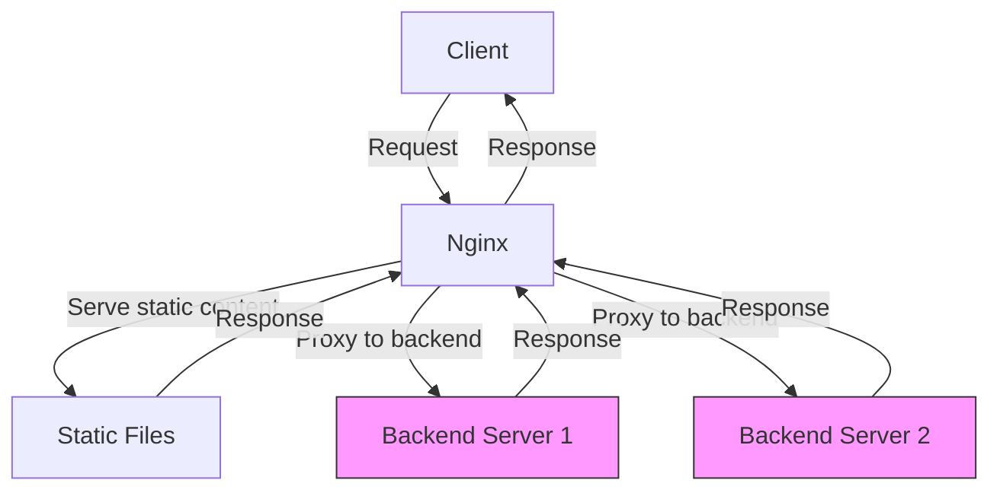

```markdown
## Introduction to Nginx

**Nginx** (pronounced "Engine-X") is a powerful, open-source software primarily used as a **web server**, **reverse proxy**, and **load balancer**. It is renowned for its speed, scalability, and efficient handling of many simultaneous connections, making it a popular choice for high-traffic websites and modern web applications.

---

### What is Nginx?

At its core, Nginx is a program that listens for requests from users (clients) trying to access websites or web applications hosted on servers. It then processes these requests and sends back the appropriate responses, such as web pages, images, or data.

**Why use Nginx?**  
- **High Performance:** Unlike traditional web servers that create a new process or thread for each connection, Nginx uses an event-driven, asynchronous architecture. This allows it to handle thousands of connections simultaneously with low resource consumption.  
- **Versatility:** It’s not just a web server. Nginx can act as a **reverse proxy** (forwarding client requests to backend servers), a **load balancer** (distributing traffic evenly across multiple servers), and even a **content cache** to speed up responses.  
- **Open Source & Extensible:** Developed initially by Igor Sysoev in 2004, Nginx has a large community and many modules for various functionalities.

---

### A Brief History of Nginx

Nginx was created by Igor Sysoev to solve the **C10k problem** — the challenge of handling 10,000 simultaneous connections efficiently. Released in 2004, it quickly gained popularity for its unique architecture and speed. Over the years, it evolved beyond a simple web server to become a multifunctional tool critical in modern web infrastructure.

---

### Understanding Nginx’s Roles with Real-World Analogies

| Role              | Explanation                                           | Analogy                                              |
|-------------------|------------------------------------------------------|-----------------------------------------------------|
| **Web Server**    | Serves web pages and content directly to users.      | A **waiter** delivering food at a restaurant.       |
| **Reverse Proxy** | Forwards client requests to one or more backend servers, then returns the server responses to clients. | A **receptionist** who directs visitors to the right department. |
| **Load Balancer** | Distributes incoming traffic evenly across multiple servers to prevent overload. | A **traffic cop** directing cars to different lanes to avoid congestion. |

---

### How Nginx Works: Conceptual Flow

1. A user types a URL or clicks a link.  
2. The request reaches the Nginx server.  
3. Nginx checks if it can serve the request directly (e.g., static files).  
4. If not, it forwards the request to backend servers (reverse proxy).  
5. If multiple backend servers exist, Nginx distributes requests among them (load balancing).  
6. The response is sent back to the user.

---

### Mermaid Diagram: Nginx Request Handling Flow



---

### Simple Python Example: Simulating Nginx’s Reverse Proxy Behavior

Below is a basic Python example that simulates a simplified version of what Nginx does as a reverse proxy — forwarding client requests to a backend server and returning the response.

```python
import http.server
import socketserver
import requests

# Backend server simulation URL (for example purposes)
BACKEND_URL = "http://httpbin.org/get"

class ReverseProxyHandler(http.server.SimpleHTTPRequestHandler):
    def do_GET(self):
        # Forward the request to the backend server
        print(f"Forwarding request for {self.path} to backend server...")
        backend_response = requests.get(BACKEND_URL)

        # Send response status code
        self.send_response(backend_response.status_code)

        # Send headers
        for header_key, header_value in backend_response.headers.items():
            # Exclude 'Transfer-Encoding' to avoid chunked encoding issues
            if header_key.lower() != 'transfer-encoding':
                self.send_header(header_key, header_value)
        self.end_headers()

        # Send the backend response content to the client
        self.wfile.write(backend_response.content)

# Run the proxy server on localhost port 8080
PORT = 8080
with socketserver.TCPServer(("", PORT), ReverseProxyHandler) as httpd:
    print(f"Reverse proxy running at http://localhost:{PORT}")
    httpd.serve_forever()
```

**Explanation:**  
This script creates a simple HTTP server that listens for incoming GET requests. Instead of serving content directly, it forwards the request to a backend server (here simulated by `httpbin.org`), fetches the response, and sends it back to the client. This mimics Nginx’s **reverse proxy** functionality.

---

### Summary

- **Nginx** is a versatile, high-performance server software that efficiently handles many simultaneous connections.  
- It originated to solve performance bottlenecks in web servers and has since grown into a multi-role tool: web server, reverse proxy, and load balancer.  
- Its event-driven architecture is key to its speed and scalability.  
- Real-world analogies like waiters, receptionists, and traffic cops help simplify the understanding of its roles.  
- Using tools like Nginx ensures that websites and applications can handle high traffic smoothly and reliably.

---

With this foundational understanding, you are now ready to explore how to install, configure, and optimize Nginx for your web projects!
```