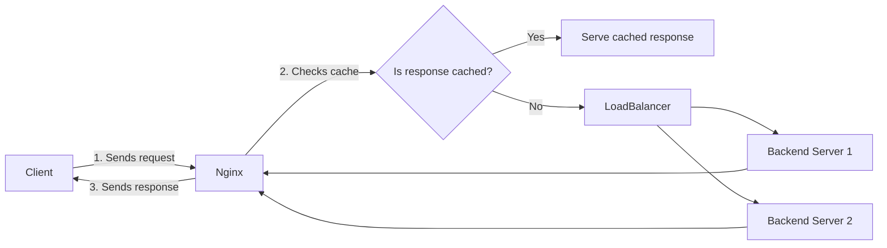

```markdown
## Key Features of Nginx

Nginx is a powerful, high-performance web server and reverse proxy server widely used for hosting websites and applications. It is renowned for its stability, rich feature set, simple configuration, and low resource consumption. Understanding its key features will help you leverage Nginx effectively in your web infrastructure.

---

### 1. Reverse Proxy

**What is it?**  
A **reverse proxy** acts as an intermediary between clients (users) and backend servers. Instead of clients connecting directly to your application servers, they connect to Nginx, which forwards the requests to your backend servers.

**Why use it?**  
- **Security:** Hide backend server details from clients.  
- **Load Distribution:** Manage and optimize traffic to backend servers.  
- **SSL Termination:** Offload SSL processing from backend servers to Nginx.

**Analogy:**  
Think of a reverse proxy as a receptionist at a company’s front desk. Visitors (clients) come to the receptionist (Nginx), who then directs them to the correct department (backend servers) without visitors knowing the internal layout.

---

### 2. Load Balancing

**What is it?**  
**Load balancing** distributes incoming network traffic across multiple servers to ensure no single server becomes overwhelmed.

**Why use it?**  
- Prevents server overloads, improving performance and reliability.  
- Enables horizontal scaling by adding more servers.  
- Provides fault tolerance if one server fails.

**Analogy:**  
Imagine a busy restaurant with multiple waiters. The host (Nginx) seats guests evenly among waiters so that no waiter is overloaded and everyone gets good service.

---

### 3. Caching

**What is it?**  
**Caching** temporarily stores copies of responses from backend servers so repeated requests can be served faster without hitting the backend every time.

**Why use it?**  
- Reduces backend server load.  
- Speeds up response times for users.  
- Improves overall scalability.

**Analogy:**  
Consider a library with popular books. Instead of ordering a new copy each time, the library keeps a few copies on the shelf (cache) so readers can borrow them immediately.

---

### 4. SSL Termination

**What is it?**  
**SSL termination** means that Nginx handles decrypting HTTPS traffic, then forwards unencrypted requests to backend servers.

**Why use it?**  
- Reduces CPU load on backend servers.  
- Centralizes SSL certificate management.  
- Simplifies backend server configuration.

**Analogy:**  
Think of SSL termination as a security checkpoint at the entrance (Nginx decrypts the traffic), so the inside offices (backend servers) don't need to worry about security checks.

---

### 5. HTTP/2 Support

**What is it?**  
**HTTP/2** is the newer version of the HTTP protocol that improves loading speed and efficiency through multiplexing, header compression, and server push.

**Why use it?**  
- Faster page loads by allowing multiple requests simultaneously over a single connection.  
- Reduces latency and improves user experience.

**Analogy:**  
If HTTP/1.x is like sending one letter at a time through the post, HTTP/2 is like sending a whole batch of letters in one envelope, reducing trips and speeding up delivery.

---

## Visualizing Nginx Key Features: Basic Flowchart



---

## Python Example: Simple Reverse Proxy Simulation

Below is a basic Python example using the `http.server` module to simulate reverse proxy behavior. This example demonstrates forwarding a client request to a backend server and returning the response.

```python
import http.server
import socketserver
import requests

PORT = 8080
BACKEND_SERVER = "http://httpbin.org"  # Example backend server

class ReverseProxyHandler(http.server.SimpleHTTPRequestHandler):
    def do_GET(self):
        # Construct backend URL by appending client request path
        backend_url = BACKEND_SERVER + self.path
        print(f"Forwarding request to backend: {backend_url}")

        # Forward request to backend server
        backend_response = requests.get(backend_url)

        # Send response status code
        self.send_response(backend_response.status_code)

        # Send headers from backend response
        for header, value in backend_response.headers.items():
            # Skip 'Transfer-Encoding' to avoid chunked encoding issues
            if header.lower() != 'transfer-encoding':
                self.send_header(header, value)
        self.end_headers()

        # Write the backend response content to client
        self.wfile.write(backend_response.content)

if __name__ == "__main__":
    with socketserver.TCPServer(("", PORT), ReverseProxyHandler) as httpd:
        print(f"Serving reverse proxy on port {PORT}")
        httpd.serve_forever()
```

### Explanation:  
- This server listens on port `8080`.  
- When a client sends a GET request, it forwards this request to the backend server (`httpbin.org` in this example).  
- It then returns the backend server’s response to the client.  

This simple example illustrates how Nginx acts as a reverse proxy by forwarding requests and serving responses.

---

## Summary

| Feature           | What It Does                                      | Why It Matters                             | Analogy                          |
|-------------------|-------------------------------------------------|-------------------------------------------|---------------------------------|
| **Reverse Proxy**  | Forwards client requests to backend servers     | Security, load management, SSL offloading | Receptionist directing visitors |
| **Load Balancing** | Distributes requests across servers              | Performance, fault tolerance               | Host seating guests evenly       |
| **Caching**        | Stores and serves repeated responses             | Faster responses, less backend load        | Library holding popular books    |
| **SSL Termination**| Handles HTTPS encryption/decryption              | Offloads backend, centralized SSL          | Security checkpoint at entrance  |
| **HTTP/2 Support** | Improves HTTP protocol for faster communication  | Faster page loads, less latency             | Batch mailing letters            |

By mastering these features, you can build scalable, secure, and high-performance web applications using Nginx.

---
```