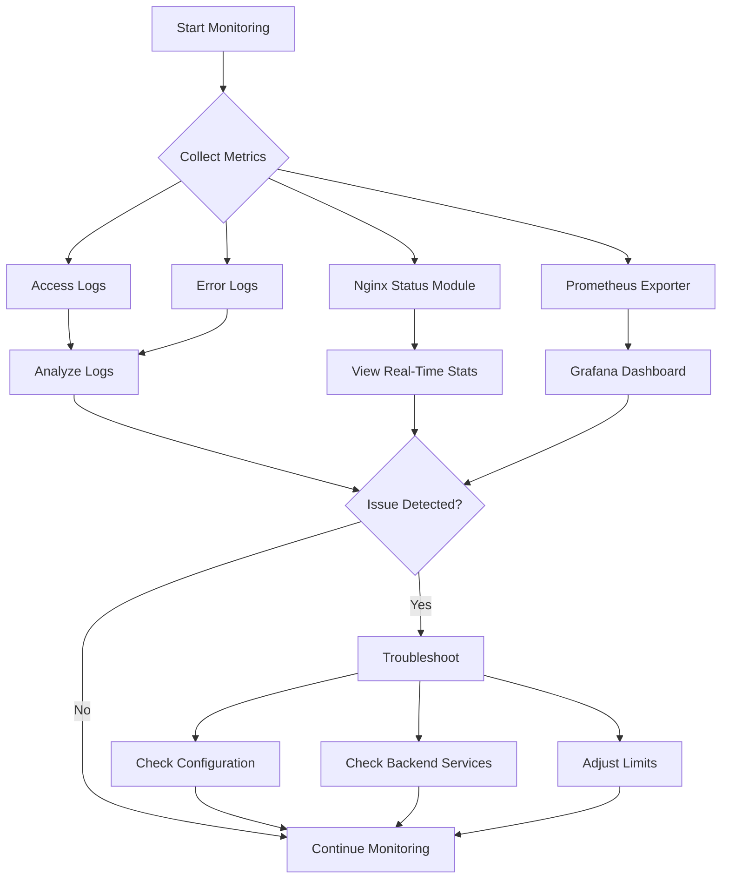

```markdown
## Monitoring and Troubleshooting Nginx

Nginx is a powerful web server and reverse proxy widely used to serve websites and applications. Like any critical infrastructure component, **monitoring** its performance and **troubleshooting** issues promptly are essential to maintaining high availability and delivering smooth user experiences.

---

### What is Monitoring and Why is it Important?

**Monitoring** Nginx means continuously observing its health, performance, and resource usage to detect anomalies or bottlenecks before they affect users. Think of monitoring as the **dashboard of your car** — it tells you if the engine is overheating, the fuel is low, or the tire pressure is off, helping you prevent breakdowns.

For Nginx, monitoring focuses on aspects such as:

- Request rates and response times
- Error rates and log analysis
- Resource consumption (CPU, memory)
- Connection status and throughput

By monitoring these metrics, you can proactively address issues like slow responses, server crashes, or traffic spikes.

---

### Troubleshooting: Diagnosing and Resolving Issues

**Troubleshooting** is the process of identifying the root cause when problems arise and then fixing them. Imagine your car stalls suddenly; troubleshooting is the mechanic’s job to determine whether it’s the spark plug, fuel pump, or battery causing the issue.

For Nginx, common issues include:

- Configuration errors causing startup failures
- High latency or timeouts
- 5xx server errors
- Resource exhaustion or connection limits

Effective troubleshooting leverages logs, metrics, and tools to diagnose and resolve these problems.

---

## Key Methods to Monitor Nginx

### 1. Access and Error Logs

Nginx generates two primary logs:

- **Access logs**: Record every request served, including client IP, requested URL, response status, and response time.
- **Error logs**: Record any server errors or warnings.

These logs act like a **black box recorder** for your server, providing detailed records to analyze.

**Configuring logs in `nginx.conf`:**

```nginx
http {
    access_log /var/log/nginx/access.log;
    error_log /var/log/nginx/error.log warn;
}
```

---

### 2. Status Module (`stub_status`)

Nginx’s built-in `stub_status` module provides a simple webpage with real-time stats like active connections, handled requests, and more.

**Example configuration:**

```nginx
location /nginx_status {
    stub_status;
    allow 127.0.0.1;  # Only allow local access
    deny all;
}
```

Visiting `http://localhost/nginx_status` shows metrics such as:

- Active connections
- Accepted connections
- Requests per second

---

### 3. Prometheus and Grafana Integration

For sophisticated monitoring, Nginx Plus (commercial) or open-source exporters allow exporting Nginx metrics to **Prometheus**, a popular monitoring system. These metrics can then be visualized with **Grafana** dashboards.

---

### 4. Log Analysis with ELK Stack or Filebeat

Tools like the **Elastic Stack** (Elasticsearch, Logstash, Kibana) or **Filebeat** can parse, index, and visualize Nginx logs, providing deep insights and alerting capabilities.

---

## Troubleshooting Common Nginx Issues

| Issue                    | Cause                                   | Troubleshooting Step                             |
|--------------------------|-----------------------------------------|-------------------------------------------------|
| Nginx fails to start     | Configuration syntax error              | Run `nginx -t` to test the configuration         |
| 502 Bad Gateway          | Backend server down or unreachable     | Check backend service and Nginx proxy settings   |
| High latency or timeouts | Overloaded server or slow backend      | Monitor resource usage and optimize configuration |
| Too many connections     | Connection limits reached               | Adjust `worker_connections` and `worker_processes` |

---

## Python Script Example: Parsing Nginx Access Logs

Let's write a simple Python script to parse Nginx access logs and calculate the number of requests per HTTP status code.

```python
import re
from collections import defaultdict

# Regular expression to parse common Nginx access log format
log_pattern = re.compile(
    r'(?P<remote_addr>\S+) - - \[(?P<time>.*?)\] "(?P<request>.*?)" '
    r'(?P<status>\d{3}) (?P<body_bytes_sent>\d+) "(?P<referrer>.*?)" "(?P<user_agent>.*?)"'
)

def parse_nginx_log(file_path):
    status_counts = defaultdict(int)
    
    with open(file_path, 'r') as file:
        for line in file:
            match = log_pattern.match(line)
            if match:
                status = match.group('status')
                status_counts[status] += 1
    
    return status_counts

if __name__ == "__main__":
    log_file = "/var/log/nginx/access.log"
    counts = parse_nginx_log(log_file)
    
    print("HTTP Status Code Counts:")
    for status, count in counts.items():
        print(f"Status {status}: {count} requests")
```

**Explanation:**

- The script reads the Nginx access log file.
- It uses a regex to extract the HTTP status code from each line.
- It counts how many requests resulted in each status.
- It outputs a summary, helping to spot errors or anomalies.

---

## Visualizing Nginx Monitoring and Troubleshooting Workflow



---

## Summary

- **Monitoring** Nginx is vital for maintaining server reliability and performance.
- Logs, status modules, and external tools like Prometheus provide valuable data.
- **Troubleshooting** involves systematic diagnosis using logs, configuration checks, and performance metrics.
- Simple Python scripts can automate log parsing to gain insights.
- Visual tools and dashboards help visualize server health and speed up problem detection.

By mastering these monitoring and troubleshooting techniques, you ensure your Nginx server runs smoothly and efficiently, keeping your applications available and responsive.
```