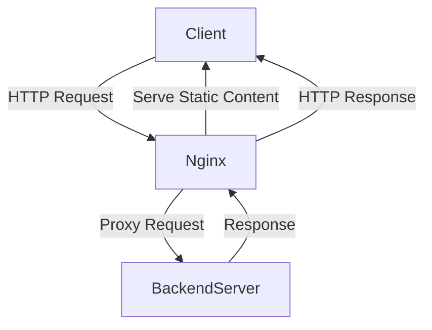

```markdown
## Nginx Installation and Setup

Nginx (pronounced "engine-x") is a powerful, high-performance web server and reverse proxy server known for its ability to handle thousands of simultaneous connections efficiently. It is widely used to serve static content, load balance HTTP requests, and act as a gateway for backend services.

---

### What is Nginx and Why Use It?

Think of **Nginx** as a highly skilled traffic controller at a busy intersection. Just like a traffic controller efficiently directs vehicles to prevent jams, Nginx manages incoming web traffic, ensuring smooth and fast delivery of web pages and resources to users.

- **Web Server:** Serves web pages to users' browsers.
- **Reverse Proxy:** Forwards client requests to backend servers.
- **Load Balancer:** Distributes requests evenly across multiple servers.

Its event-driven architecture makes it lightweight and capable of handling many connections concurrently, unlike traditional servers that spawn a new process for each connection.

---

## Step-by-Step Guide to Installing Nginx

Below is a beginner-friendly guide to installing Nginx on popular operating systems.

---

### 1. Installing Nginx on Ubuntu (22.04 / 24.04 LTS)

Ubuntu uses the APT package manager to install software.

```bash
# Step 1: Update package lists
sudo apt update

# Step 2: Install Nginx
sudo apt install nginx -y

# Step 3: Start and enable Nginx to run on boot
sudo systemctl start nginx
sudo systemctl enable nginx

# Step 4: Verify Nginx is running
sudo systemctl status nginx
```

- You can now visit `http://localhost` or your server's IP address in a browser to see the default Nginx welcome page.

---

### 2. Installing Nginx on CentOS / RHEL (8 and above)

Use the DNF package manager for installation.

```bash
# Step 1: Install EPEL repository if not present
sudo dnf install epel-release -y

# Step 2: Install Nginx
sudo dnf install nginx -y

# Step 3: Start and enable Nginx
sudo systemctl start nginx
sudo systemctl enable nginx

# Step 4: Verify the service status
sudo systemctl status nginx
```

---

### 3. Installing Nginx on FreeBSD

FreeBSD offers two main methods: packages and ports.

- **Packages:** Quick installation with precompiled binaries.

```bash
sudo pkg install nginx
sudo sysrc nginx_enable=yes
sudo service nginx start
```

- **Ports:** Allows customization during build (advanced users).

```bash
cd /usr/ports/www/nginx
sudo make install clean
sudo sysrc nginx_enable=yes
sudo service nginx start
```

---

### 4. Installing Nginx from Source (Linux)

Installing from source is useful if you want to customize modules or build the latest version.

```bash
# Step 1: Install build dependencies
sudo apt update
sudo apt install build-essential libpcre3 libpcre3-dev zlib1g zlib1g-dev libssl-dev -y

# Step 2: Download the latest stable source
wget http://nginx.org/download/nginx-1.24.0.tar.gz
tar -zxvf nginx-1.24.0.tar.gz
cd nginx-1.24.0

# Step 3: Configure the build options
./configure --with-http_ssl_module

# Step 4: Build and install
make
sudo make install

# Step 5: Start Nginx
sudo /usr/local/nginx/sbin/nginx

# To stop Nginx:
# sudo /usr/local/nginx/sbin/nginx -s stop
```

---

## Basic Nginx Configuration to Get Started

Nginx configurations are stored in `/etc/nginx/nginx.conf` (or `/usr/local/nginx/conf/nginx.conf` if installed from source). The configuration uses a modular structure with **blocks** like `http`, `server`, and `location`.

- **http block:** Defines global HTTP settings.
- **server block:** Defines a virtual server (domain or IP).
- **location block:** Defines URL-specific rules.

### Example: Simple Server Block

```nginx
server {
    listen 80;                 # Listen on port 80 (HTTP)
    server_name example.com;   # Domain name

    location / {
        root /var/www/html;    # Serve files from this directory
        index index.html;      # Default file
    }
}
```

---

## Conceptual Flow of Request Handling in Nginx



- When a client sends a request, **Nginx first checks if it can serve static content** itself.
- If not, it forwards the request to a backend server (like an application server).
- Once the backend responds, Nginx sends the final response back to the client.

---

## Python Example: Interacting with Nginx Server

You can use Python to check if your Nginx server is running and responding properly.

```python
import requests

def check_nginx_status(url='http://localhost'):
    """
    Sends a GET request to the provided URL and prints the status.

    :param url: The URL to check (default is localhost)
    """
    try:
        response = requests.get(url)
        if response.status_code == 200:
            print(f"Nginx is up and running! Status Code: {response.status_code}")
        else:
            print(f"Nginx responded with status code: {response.status_code}")
    except requests.exceptions.RequestException as e:
        print(f"Failed to connect to Nginx server: {e}")

if __name__ == "__main__":
    check_nginx_status()
```

**Explanation:**

- This script sends a simple HTTP GET request to your Nginx server.
- It helps verify that your server responds without errors.
- Make sure to install `requests` if you don't have it: `pip install requests`.

---

## Summary

- **Nginx** is a versatile and efficient web server and proxy.
- Installation varies by OS: use package managers on Linux/BSD or source for custom builds.
- Basic configuration involves defining a server block to serve content.
- Nginx effectively manages connections like a skilled traffic controller.
- Use Python scripts to programmatically verify your Nginx server's health.

With this knowledge, you're well-equipped to install, configure, and validate your Nginx server setup!

---
```