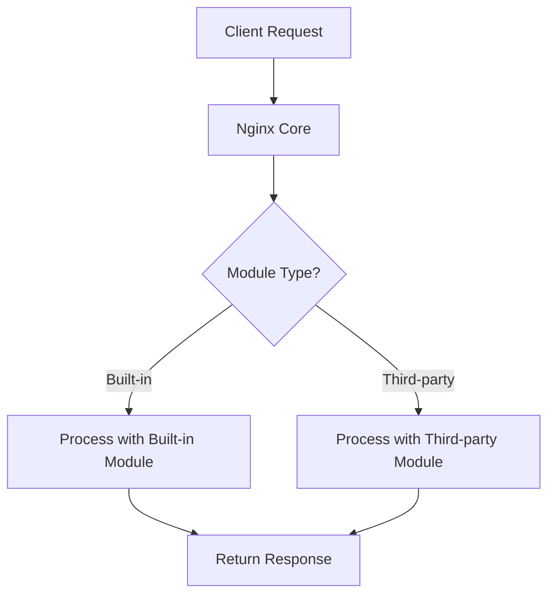

```markdown
## Nginx Modules and Extensibility

Nginx is a powerful, high-performance web server and reverse proxy known for its speed and scalability. One of its key strengths is its **modular architecture**, which allows users to enable or extend its capabilities using built-in or third-party modules. This modularity makes Nginx highly customizable to meet the specific needs of diverse applications.

---

### What are Nginx Modules?

Think of **Nginx modules** like the apps on your smartphone. By default, your phone has core functionality (calling, texting), but installing apps lets you do much more (gaming, photo editing, social media). Similarly, Nginx comes with a base set of features, but modules add specific functionalities such as:

- Handling different protocols (HTTP, mail, TCP/UDP)
- Enabling load balancing
- Supporting caching
- Adding security features
- Serving dynamic content via FastCGI, WSGI, or SCGI
- Extending with scripting languages like njs

Modules can be **built-in** (compiled with Nginx by default) or **third-party** (added later to extend features).

---

### Why Use Modules?

Modules make Nginx:

- **Flexible**: Enable only what you need, avoiding bloat.
- **Extensible**: Add new features without changing the core code.
- **Efficient**: Process requests faster by offloading tasks to specialized modules.

---

### Built-in vs Third-party Modules

| Feature             | Built-in Modules                               | Third-party Modules                               |
|---------------------|-----------------------------------------------|--------------------------------------------------|
| Included by default  | Yes                                           | No (must be manually added)                       |
| Stability           | Highly stable and well-tested                  | Varies; depends on the source and maintenance     |
| Ease of installation | Comes with Nginx; just enable in config       | Requires downloading, compiling, or dynamic loading |
| Examples            | `http_ssl_module`, `http_gzip_module`          | `ngx_brotli` (compression), `lua-nginx-module`    |

---

### How to Enable and Configure Modules

- **Compile-time modules**: Some modules are included or excluded when compiling Nginx from source using `./configure` flags.
- **Dynamic modules**: Newer Nginx versions support loading modules dynamically via the `load_module` directive in the configuration file.

#### Example: Enabling a Built-in Module (gzip)

```nginx
http {
    gzip on;
    gzip_types text/plain application/json;
}
```

This snippet enables gzip compression to reduce response size and improve speed.

#### Example: Loading a Dynamic Module

```nginx
load_module modules/ngx_http_geoip_module.so;

http {
    geoip_country /usr/share/GeoIP/GeoIP.dat;
}
```

---

### Real-World Analogy: Modules as LEGO Bricks

Imagine Nginx as a LEGO base plate — solid and functional on its own. Modules are LEGO bricks you attach to build specialized structures:

- A red brick might add a door (SSL support).
- A blue brick adds windows (load balancing).
- Custom bricks from third-party suppliers represent unique parts (custom logging, advanced caching).

You pick and assemble the bricks you need, creating a tailored solution.

---

### Visualizing Nginx Module Processing Flow



---

### Python Example: Simulating Module Processing

Though Nginx modules are written in C, we can simulate the concept in Python to understand how requests might be routed to different modules based on type.

```python
class NginxModule:
    """Base class for an Nginx module simulation."""
    def process(self, request):
        raise NotImplementedError("Module must implement the process method.")

class BuiltInModule(NginxModule):
    def process(self, request):
        return f"Processed by built-in module: {request}"

class ThirdPartyModule(NginxModule):
    def process(self, request):
        return f"Processed by third-party module: {request}"

class NginxCore:
    def __init__(self):
        # Simulated modules
        self.built_in_module = BuiltInModule()
        self.third_party_module = ThirdPartyModule()

    def handle_request(self, request, module_type='built-in'):
        if module_type == 'built-in':
            return self.built_in_module.process(request)
        elif module_type == 'third-party':
            return self.third_party_module.process(request)
        else:
            return "No suitable module found."

# Example usage
nginx = NginxCore()
print(nginx.handle_request("GET /index.html", module_type='built-in'))
print(nginx.handle_request("GET /api/data", module_type='third-party'))
```

**Output:**

```
Processed by built-in module: GET /index.html
Processed by third-party module: GET /api/data
```

This simple example illustrates how Nginx might delegate requests to different modules internally.

---

### Summary

- **Nginx modules** add or enhance features beyond the core server.
- Modules can be **built-in** (default) or **third-party** (added later).
- They allow Nginx to be **extensible** and **customizable** for various use cases.
- Modules are enabled via configuration or during compilation.
- Understanding modules helps you optimize and tailor your Nginx deployment.

With this knowledge, you can confidently explore Nginx’s rich ecosystem and adapt it to your specific web serving needs.
```