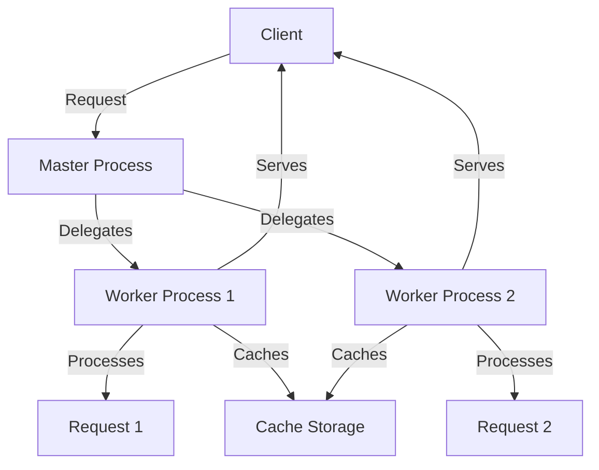

```markdown
## Nginx Performance Optimization

Nginx is a powerful, high-performance web server and reverse proxy widely used to serve web content efficiently. Optimizing Nginx performance is crucial for handling more users, reducing latency, and maximizing your server resources. This guide covers essential techniques including tuning worker processes, caching strategies, and connection handling to improve Nginx performance.

---

### 1. Understanding Nginx Architecture: The Basics

Before diving into optimization, it’s important to understand how Nginx works:

- **Master Process**: Controls worker processes and handles configuration reloads.
- **Worker Processes**: Handle actual client requests asynchronously and efficiently.

#### Why Optimize?

Imagine a busy restaurant kitchen:

- The **Master Process** is the head chef who organizes the kitchen.
- **Worker Processes** are the cooks preparing meals.

If there are too few cooks, orders pile up; too many cooks, and the kitchen becomes crowded and inefficient. Similarly, tuning the number of worker processes helps maximize throughput without wasting resources.

---

### 2. Tuning Worker Processes

By default, Nginx starts with one worker process. However, performance improves when you match the number of worker processes to your CPU cores.

```nginx
# nginx.conf
worker_processes auto;   # Automatically sets the number of workers to CPU cores
worker_connections 1024; # Max simultaneous connections per worker
```

- `worker_processes auto`: Lets Nginx automatically detect CPU cores and spawn that many workers.
- `worker_connections`: Number of simultaneous connections per worker. Total max connections = worker_processes × worker_connections.

**Analogy:** More cooks in the kitchen (worker processes) mean more dishes prepared simultaneously, but too many cooks can cause chaos.

---

### 3. Efficient Connection Handling with Keepalive

Nginx can keep connections open for multiple requests using **Keepalive connections**, reducing the overhead of creating new TCP connections.

```nginx
http {
    keepalive_timeout 65;    # Time to keep connection alive (seconds)
    keepalive_requests 100;  # Max requests per keepalive connection
}
```

- **Why?** Creating new connections is like ringing a doorbell every time you want to talk. Keeping the door open saves time.
- Keepalive reduces latency and CPU usage, especially for clients making multiple requests.

---

### 4. Caching Strategies to Reduce Load

Caching stores frequently requested data to serve it faster without recomputing or fetching from backend servers every time.

#### Types of Caching in Nginx:

- **Static File Caching:** Cache static assets like images, CSS, and JS files.
- **Proxy Cache:** Cache responses from backend servers (APIs, dynamic content).
- **FastCGI Cache:** Cache dynamic content generated by PHP or other FastCGI applications.

##### Example: Enabling Proxy Cache

```nginx
proxy_cache_path /var/cache/nginx levels=1:2 keys_zone=my_cache:10m max_size=1g inactive=60m use_temp_path=off;

server {
    location /api/ {
        proxy_cache my_cache;
        proxy_cache_valid 200 302 10m;
        proxy_cache_valid 404 1m;
        proxy_pass http://backend_server;
    }
}
```

- `proxy_cache_path`: Defines the cache location and parameters.
- `proxy_cache_valid`: Sets how long different HTTP responses are cached.

**Analogy:** Caching is like keeping popular dishes ready in the kitchen instead of cooking from scratch every time a customer orders.

---

### 5. Python Example: Simulating Nginx Worker Load

Let's simulate how adjusting the number of workers affects request handling using Python’s threading.

```python
import threading
import time
import queue

# Simulate incoming requests
requests = queue.Queue()
for i in range(50):
    requests.put(f"Request-{i+1}")

def worker(worker_id):
    while not requests.empty():
        req = requests.get()
        print(f"Worker {worker_id} processing {req}")
        time.sleep(0.1)  # Simulate request processing time
        requests.task_done()

num_workers = 4  # Simulate 4 worker processes
threads = []

for i in range(num_workers):
    t = threading.Thread(target=worker, args=(i+1,))
    t.start()
    threads.append(t)

for t in threads:
    t.join()

print("All requests processed.")
```

- This script demonstrates how multiple workers process requests concurrently.
- Increasing `num_workers` will reduce total processing time, just like tuning `worker_processes` in Nginx.

---

### 6. Visualizing Nginx Request Flow with Mermaid Diagram



- The master process delegates requests to worker processes.
- Workers process requests and serve clients.
- Workers interact with cache to speed up responses.

---

### Summary: Key Tips for Nginx Performance Optimization

| Optimization Aspect       | Key Configuration                          | Benefit                              |
|--------------------------|-------------------------------------------|------------------------------------|
| **Worker Processes**      | `worker_processes auto`                    | Utilizes all CPU cores efficiently |
| **Worker Connections**    | `worker_connections 1024`                  | Increases simultaneous connections |
| **Keepalive Connections**| `keepalive_timeout` & `keepalive_requests`| Reduces connection overhead        |
| **Caching**               | `proxy_cache`, `fastcgi_cache`             | Reduces backend load and latency   |

By adjusting these settings based on your server’s hardware and traffic patterns, you can significantly improve Nginx’s ability to handle high volumes of requests swiftly and reliably.

---

Optimizing Nginx is an ongoing process—monitor your server's performance and adjust configurations as needed for the best results!
```