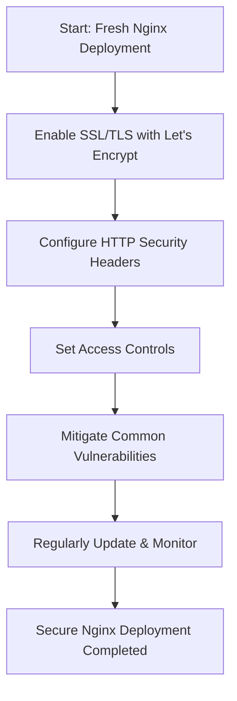

```markdown
## Security Best Practices in Nginx

Nginx is a powerful web server used globally for hosting websites and applications. Securing Nginx deployments is critical to protect your data, users, and infrastructure from evolving cyber threats. This guide covers essential **security best practices** for Nginx, focusing on **SSL/TLS encryption**, **HTTP security headers**, **access controls**, and **mitigating common vulnerabilities**.

---

### Why Secure Nginx?

Think of Nginx as the **front door to your house** (your web application). If the door is weak or unlocked, anyone can get in, steal valuables, or cause damage. Similarly, an insecure Nginx server can expose your application to hackers, data leaks, or downtime.

Securing Nginx ensures:

- Data exchanged between clients and servers is encrypted and private.
- Requests are filtered and controlled to prevent unauthorized access.
- Browsers enforce security policies to reduce risks like cross-site scripting (XSS).
- The server is hardened against common attacks and vulnerabilities.

---

## 1. Securing Nginx with SSL/TLS

### What is SSL/TLS?

**SSL/TLS** are cryptographic protocols that encrypt data transmitted over the internet. When you visit a website using `https://`, SSL/TLS secures the connection so attackers cannot eavesdrop or tamper with the data.

- **SSL (Secure Sockets Layer)** is the older protocol.
- **TLS (Transport Layer Security)** is the modern, more secure version.

### Why use SSL/TLS?

Imagine sending a postcard through the mail—anyone can read it. Now imagine sending a letter inside a locked envelope only the receiver can open. SSL/TLS acts like that locked envelope for your web traffic.

### Enabling SSL/TLS in Nginx Using Let's Encrypt

[Let's Encrypt](https://letsencrypt.org/) provides free SSL certificates, making it easy to enable HTTPS.

1. **Install Certbot** (a tool to obtain certificates):

```bash
sudo apt update
sudo apt install certbot python3-certbot-nginx
```

2. **Obtain and install the certificate:**

```bash
sudo certbot --nginx -d example.com -d www.example.com
```

Certbot automatically configures Nginx to use SSL by modifying your server block.

3. **Verify your Nginx configuration:**

```bash
sudo nginx -t
sudo systemctl reload nginx
```

### Sample Nginx SSL Configuration

```nginx
server {
    listen 443 ssl;
    server_name example.com www.example.com;

    ssl_certificate /etc/letsencrypt/live/example.com/fullchain.pem;
    ssl_certificate_key /etc/letsencrypt/live/example.com/privkey.pem;

    ssl_protocols TLSv1.2 TLSv1.3;
    ssl_ciphers HIGH:!aNULL:!MD5;

    root /usr/share/nginx/html;
    index index.html;

    location / {
        try_files $uri $uri/ =404;
    }
}
```

---

## 2. Using HTTP Security Headers

### What are HTTP Security Headers?

HTTP headers are pieces of information sent between the server and client. Security headers tell browsers how to behave securely with your website, preventing attacks like cross-site scripting (XSS), clickjacking, and data injection.

### Key Security Headers and Their Purpose

| Header                     | Purpose                                                       | Analogy                                        |
|----------------------------|---------------------------------------------------------------|------------------------------------------------|
| `Content-Security-Policy`   | Controls which resources can load on your site.               | Like a bouncer checking who can enter a club.  |
| `Strict-Transport-Security` | Forces browsers to use HTTPS only.                            | A guard that insists on locked doors only.     |
| `X-Frame-Options`           | Prevents your site from being embedded in frames/iframes.     | Prevents someone from creating fake windows.   |
| `X-Content-Type-Options`    | Stops MIME-sniffing attacks by enforcing declared content types. | Ensures packages are opened as labeled.         |
| `Referrer-Policy`           | Controls how much referrer info is shared with other sites.   | Controls what info you share with neighbors.   |

### Adding Security Headers in Nginx

```nginx
server {
    listen 443 ssl;
    server_name example.com;

    # SSL config here...

    add_header Strict-Transport-Security "max-age=31536000; includeSubDomains" always;
    add_header X-Frame-Options "DENY" always;
    add_header X-Content-Type-Options "nosniff" always;
    add_header Referrer-Policy "no-referrer-when-downgrade" always;
    add_header Content-Security-Policy "default-src 'self'; script-src 'self' 'unsafe-inline'" always;

    # Other config...
}
```

---

## 3. Implementing Access Controls

### What is Access Control?

Access control restricts who can access your server or certain resources, preventing unauthorized users from reaching sensitive data.

### Types of Access Controls in Nginx

- **IP Whitelisting/Blacklisting**: Allow or deny requests based on IP addresses.
- **Basic Authentication**: Require username and password for access.
- **Rate Limiting**: Limit the number of requests to prevent abuse.

### Example: IP Whitelisting

```nginx
location /admin {
    allow 192.168.1.0/24;  # Allow your internal network
    deny all;              # Deny everyone else
}
```

### Example: Basic Authentication

1. Create password file:

```bash
sudo apt install apache2-utils
sudo htpasswd -c /etc/nginx/.htpasswd user1
```

2. Configure Nginx:

```nginx
location /secure {
    auth_basic "Restricted Area";
    auth_basic_user_file /etc/nginx/.htpasswd;
}
```

---

## 4. Mitigating Common Vulnerabilities

### Common Vulnerabilities in Nginx Deployments

- **Directory Listing**: Exposes file structure.
- **Buffer Overflow Attacks**: Exploiting server bugs.
- **Cross-Site Scripting (XSS)**: Injecting malicious scripts.
- **Clickjacking**: Trick users into clicking hidden elements.

### Best Practices to Mitigate

- Disable directory listing:

```nginx
location / {
    autoindex off;
}
```

- Keep Nginx updated regularly.
- Use **Content Security Policy** and other security headers.
- Limit request body size:

```nginx
client_max_body_size 1m;
```

- Use fail2ban or other intrusion prevention tools.

---

## Visual Flowchart: Securing Nginx Deployment



---

## Bonus: Python Script to Check SSL Certificate Expiry

You can automate monitoring of your SSL certificate expiry using Python, helping you avoid unexpected downtime.

```python
import ssl
import socket
from datetime import datetime

def get_ssl_expiry_date(hostname, port=443):
    context = ssl.create_default_context()
    with socket.create_connection((hostname, port)) as sock:
        with context.wrap_socket(sock, server_hostname=hostname) as ssock:
            cert = ssock.getpeercert()
            expiry_date = datetime.strptime(cert['notAfter'], '%b %d %H:%M:%S %Y %Z')
            return expiry_date

if __name__ == "__main__":
    domain = "example.com"
    expiry = get_ssl_expiry_date(domain)
    days_left = (expiry - datetime.utcnow()).days
    print(f"SSL certificate for {domain} expires on {expiry} ({days_left} days left)")
    if days_left < 30:
        print("Warning: SSL certificate is expiring soon!")
```

---

## Summary

Securing Nginx involves:

- Encrypting traffic with **SSL/TLS**.
- Adding **HTTP security headers** to enforce browser policies.
- Applying **access controls** to restrict unauthorized access.
- Mitigating vulnerabilities by disabling risky features and hardening server configurations.
- Continuously monitoring and updating your setup.

By following these best practices, you create a robust defense that keeps your web applications safe from common threats.
```