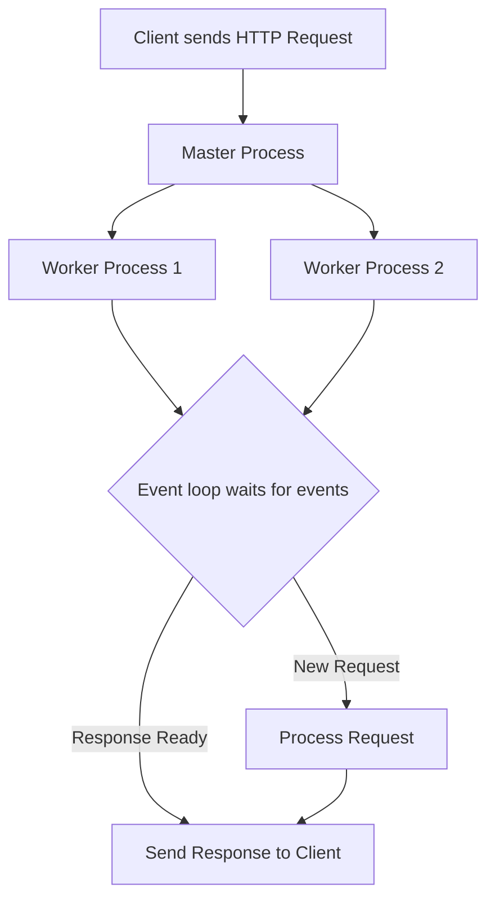

```markdown
## What is Nginx?

**Nginx** (pronounced "engine x") is a powerful, high-performance web server and reverse proxy server. Initially released in 2004 by Igor Sysoev, it has become one of the most popular web servers worldwide due to its speed, scalability, and low resource consumption.

### What Does Nginx Do?

At its core, Nginx serves web content to users by responding to HTTP requests. Beyond this, it can also:

- Act as a **reverse proxy**, forwarding client requests to other servers.
- Function as a **load balancer**, distributing incoming traffic efficiently across multiple servers.
- Serve as a **mail proxy** for email protocols.
- Provide **HTTP caching** to speed up repeated requests.

---

## Understanding Nginx Architecture

Nginx is designed around an **event-driven, asynchronous architecture** that allows it to handle thousands of connections simultaneously with minimal memory usage.

### Event-Driven Model Explained

Imagine a busy restaurant kitchen:

- In a traditional web server (like Apache’s older prefork model), every customer order gets a dedicated chef. If 100 customers arrive, you need 100 chefs, even if some orders take longer than others.
- Nginx’s event-driven model is like having a small team of chefs who efficiently juggle multiple orders at once, focusing on tasks only when they need attention, without waiting idly.

This design lets Nginx serve many client requests concurrently using just a few worker processes.

---

### How Nginx Works Internally

- **Master process:** Controls the worker processes and reads configuration files.
- **Worker processes:** Handle all client requests asynchronously using an event loop.
- **Event loop:** Listens for events (such as new requests or completed responses) and processes them without blocking.

---

## Nginx vs. Other Web Servers

| Feature            | Nginx                           | Apache                         |
|--------------------|--------------------------------|-------------------------------|
| Architecture       | Event-driven, asynchronous      | Process/thread-based           |
| Performance        | Handles many concurrent requests| Can be slower under heavy load|
| Resource Usage     | Low memory footprint            | Higher memory usage            |
| Configuration      | Simple and modular              | Flexible but complex           |
| Use Case           | Static content, reverse proxy   | Dynamic content, .htaccess support |

---

## Real-World Analogy: Nginx as a Traffic Controller

Picture Nginx as a highly skilled traffic controller at a busy intersection:

- It directs incoming cars (client requests) to different lanes (servers) efficiently.
- When traffic is heavy, it ensures no lane gets overwhelmed (load balancing).
- If a lane is blocked, it quickly redirects traffic to keep things moving smoothly (reverse proxy).
- It remembers frequent travelers and lets them pass faster next time (caching).

---

## Simple Python Example: Simulating a Basic Event Loop

While Nginx’s event-driven model is implemented in C for high performance, here’s a simplified Python analogy using `asyncio` to demonstrate handling multiple connections asynchronously:

```python
import asyncio

async def handle_request(client_id):
    print(f"Start processing request from client {client_id}")
    # Simulate I/O-bound operation (e.g., reading data)
    await asyncio.sleep(1)
    print(f"Finished processing request from client {client_id}")

async def main():
    tasks = [handle_request(i) for i in range(1, 6)]
    await asyncio.gather(*tasks)

# Run the event loop
asyncio.run(main())
```

**Explanation:**

- Instead of blocking and waiting for each request to complete one by one, this code handles multiple requests concurrently.
- This mirrors how Nginx’s event loop allows multiple connections to be processed in parallel without creating a new thread or process for each.

---

## Mermaid Diagram: Nginx Event-Driven Architecture Flow



---

## Summary

- **Nginx** is a versatile web server known for its high performance and scalability.
- Its **event-driven architecture** lets it handle thousands of simultaneous connections efficiently.
- It can serve as a **web server**, **reverse proxy**, **load balancer**, and more.
- Compared to traditional web servers like Apache, Nginx uses fewer resources and excels at serving static content and managing high traffic.
- Understanding Nginx’s design helps you optimize your web infrastructure for speed and reliability.

By thinking of Nginx as an event-driven traffic controller, you can appreciate how it elegantly manages web traffic with minimal overhead—making it a favorite among developers and system administrators alike.
```